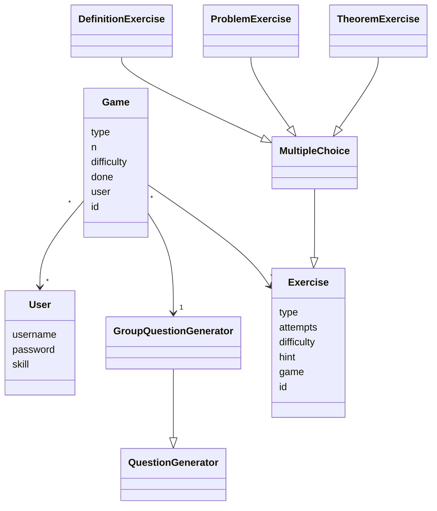

# Arkkitehtuurikuvaus

## Sovelluslogiikka
Sovelluksen loogisen tietomallin muodostavat luokat [User](https://github.com/immone/ot-harjoitustyo-s2023/blob/master/src/entities/user.py), [Game](https://github.com/immone/ot-harjoitustyo-s2023/blob/master/src/entities/game.py)
sekä [Exercises](https://github.com/immone/ot-harjoitustyo-s2023/blob/master/src/entities/exercise.py), jotka kuvaavat yhtä peliä, pelin sisältämiä harjoituksia ja käyttäjää, joka harjoituksia pelaa.
Lisäksi luokka [QuestionGenerator](https://github.com/immone/ot-harjoitustyo-s2023/blob/master/src/entities/question_generator.py) kuvaa oliota, joka luo tehtäviä.
QuestionGenerator sekä Exercise-luokilla esiintyy aliluokkia, jotka viittaavat tiettyihin tehtäviin tai niiden generointiin.

