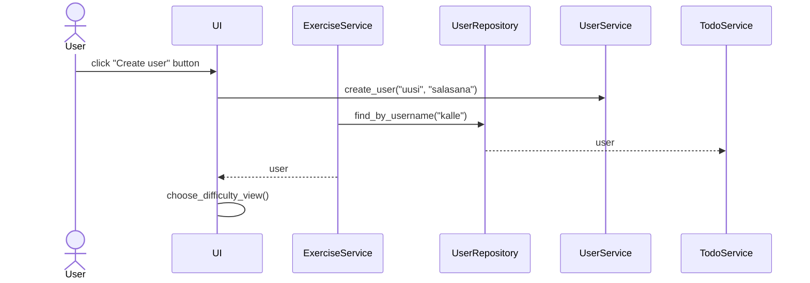

# Arkkitehtuurikuvaus

## Käyttöliittymä

Käyttöliittymä sisältää viisi erillistä näkymää:
* Kirjautuminen ja käyttäjän luonti
* Käyttäjän vaikeustason valitseminen
* Harjoituksien vaikeustason ja kysymyksien tyypin valitseminen 
* Kaikki valikoituja harjoituksia vastaaavat kysymykset (kesken)
* Yksittäinen kysymys (kesken)

Jokainen näkymistä on toteutettu omana luokkanaan ja näkymien näyttämisestä vastaa [UI-luokka](https://github.com/immone/ot-harjoitustyo-s2023/blob/master/src/ui/ui.py).

## Sovelluslogiikka
Sovelluksen loogisen tietomallin muodostavat luokat [User](https://github.com/immone/ot-harjoitustyo-s2023/blob/master/src/entities/user.py), [Game](https://github.com/immone/ot-harjoitustyo-s2023/blob/master/src/entities/game.py)
sekä [Exercises](https://github.com/immone/ot-harjoitustyo-s2023/blob/master/src/entities/exercise.py), jotka kuvaavat yhtä peliä, pelin sisältämiä harjoituksia ja käyttäjää, joka harjoituksia pelaa.
Lisäksi luokka [QuestionGenerator](https://github.com/immone/ot-harjoitustyo-s2023/blob/master/src/entities/question_generator.py) kuvaa oliota, joka luo tehtäviä.
QuestionGenerator sekä Exercise-luokilla esiintyy aliluokkia, jotka viittaavat tiettyihin tehtäviin tai niiden generointiin.

** Tietojen pysyväistallennus

Pakkauksen _repositories_ luokat `ExerciseRepository` ja `UserRepository` huolehtivat tietojen tallentamisesta SQLite-tietokantaan.

** Päätoiminnallisuudet

Uuden käyttäjän luonti etenee seuraavasti, kun käyttöliittymän User- ja Password-kenttiin syötetään halutut arvot:

