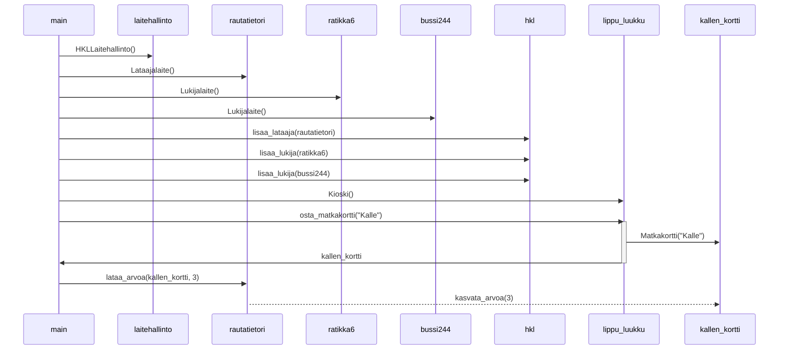

```mermaid
sequenceDiagram
    main->>laitehallinto: HKLLaitehallinto() 
    main->>rautatietori: Lataajalaite()
    main->>ratikka6: Lukijalaite()
    main->>bussi244: Lukijalaite()
    
    main->>hkl: lisaa_lataaja(rautatietori)
    
    main->>hkl: lisaa_lukija(ratikka6)
    
    main->> hkl: lisaa_lukija(bussi244)

    main->>lippu_luukku: Kioski()
    main ->> lippu_luukku: osta_matkakortti("Kalle")
    activate lippu_luukku
    lippu_luukku ->> kallen_kortti: Matkakortti("Kalle")
    lippu_luukku ->> main: kallen_kortti
    deactivate lippu_luukku
    
    main->>rautatietori : lataa_arvoa(kallen_kortti, 3)
    activate rautatietori
    rautatietori-->>kallen_kortti: kasvata_arvoa(3)
    activate kallen_kortti
```