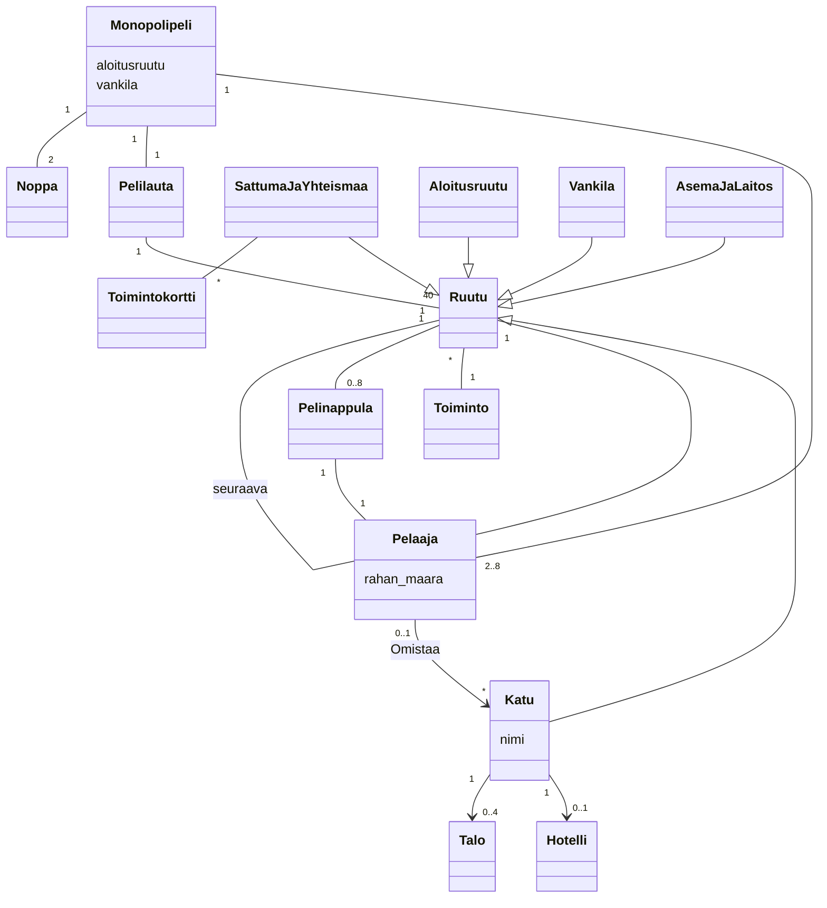

```mermaid
 classDiagram
    Monopolipeli "1" -- "2" Noppa
    Monopolipeli "1" -- "1" Pelilauta
    Pelilauta "1" -- "40" Ruutu
    Ruutu "1" -- "1" Ruutu : seuraava
    Ruutu "1" -- "0..8" Pelinappula
    Pelinappula "1" -- "1" Pelaaja
    Pelaaja "2..8" -- "1" Monopolipeli
    Ruutu "*" -- "1" Toiminto
    Pelaaja "0..1" --> "*" Katu : Omistaa
    Katu "1" --> "0..4" Talo
    Katu "1" --> "0..1" Hotelli 
    SattumaJaYhteismaa "*" -- "*" Toimintokortti
    Aloitusruutu --|> Ruutu
    Vankila --|> Ruutu
    SattumaJaYhteismaa --|> Ruutu
    AsemaJaLaitos --|> Ruutu
    Katu --|> Ruutu
    class Pelaaja{
        rahan_maara
    }
    class Katu{
         nimi
    }
    class Monopolipeli{
         aloitusruutu
         vankila
    }
         
```